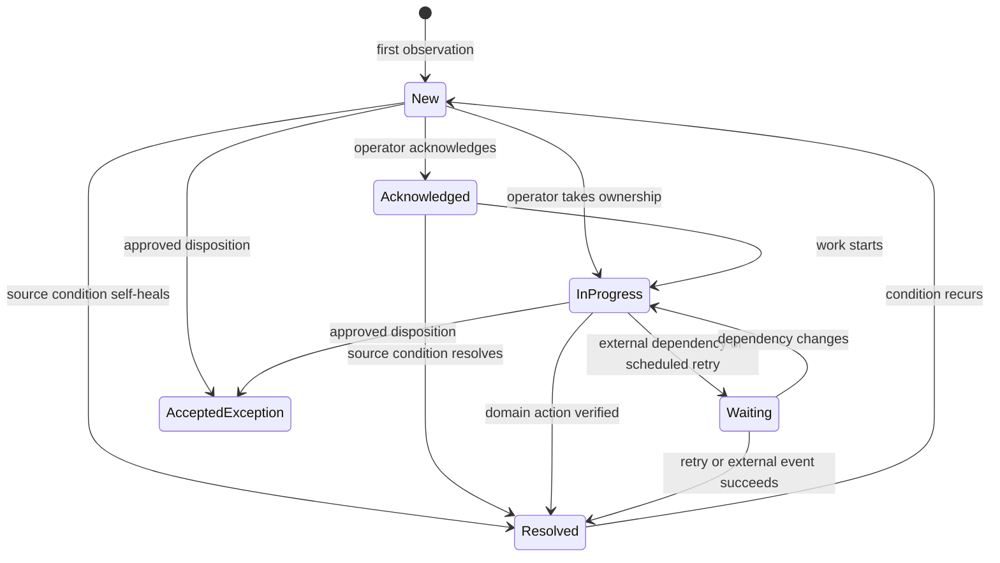
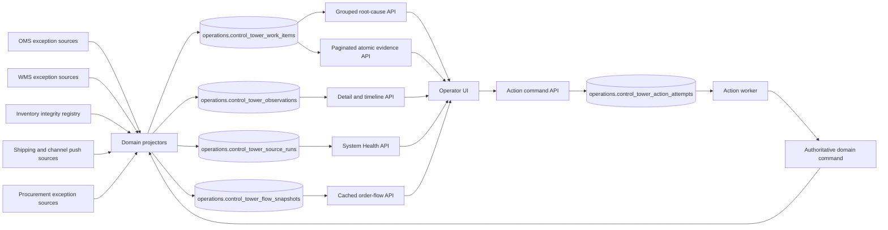

# Operations Control Tower Design

Implementation and rollout procedures are documented in
`docs/OPERATIONS-CONTROL-TOWER-RUNBOOK.md`.

## Status

Proposed design for review. This document defines the product, data, API,
workflow, performance, security, and rollout requirements for replacing the
current live-aggregation Control Tower.

No production behavior should be changed until the decisions and phase gates
in this document are reviewed.

## Executive Decision

The Operations Control Tower will be a persistent, materialized read model of
operational exceptions. It will not execute all domain health checks during an
interactive HTTP request, and it will not become a new authority for orders,
inventory, shipments, purchasing, or financial state.

Domain systems remain authoritative:

- OMS owns commercial order and line authority.
- WMS owns warehouse work and operational fulfillment state.
- Inventory owns quantities, movements, reservations, lots, and integrity findings.
- Shipping owns shipment requests, engine orders, physical shipments, and channel pushes.
- Procurement owns PO, receiving, landed-cost, AP, and vendor exceptions.

The Control Tower owns:

- a normalized, indexed projection of actionable exceptions;
- operator triage, assignment, acknowledgement, snooze, and escalation;
- a durable action-attempt ledger;
- links to authoritative domain records and evidence;
- source-monitor freshness and projection health;
- a unified operator experience.

The Control Tower does not own resolution. An item is resolved only when the
authoritative source reports that the underlying condition is resolved or an
explicit domain-approved disposition is recorded.

## Why The Current Design Must Be Replaced

Production evidence captured on 2026-07-10 showed:

- `GET /api/operations/control-tower?limit=250` took approximately 19.3 seconds.
- The response was approximately 498 KB.
- One request reached Heroku's 30-second H12 timeout.
- The request recomputed OMS, WMS, shipping, inventory, procurement, and OMS
  waterfall health in the interactive request path.
- The UI mixed health summaries, aggregated issue categories, raw evidence,
  source status, and partially actionable work.

This causes both performance and product-definition failures. A control tower
cannot make operators wait for all monitoring logic to run, and a work queue
cannot mix atomic work with aggregate diagnostics.

### Existing Sources And Authorities Reviewed

This design is grounded in the current implementation:

- `server/modules/operations/control-tower.service.ts` currently composes live
  monitor results during the HTTP request. It is a prototype to retire, not the
  target persistence model.
- `migrations/126_inventory_integrity_registry.sql` already defines durable
  inventory findings and immutable observations.
- `migrations/109_oms_wms_reconciliation_exceptions.sql` already defines
  idempotent WMS reconciliation exceptions with review and resolution state.
- `migrations/0566_po_exceptions.sql` already defines durable procurement
  exceptions and resolution audit fields.
- `migrations/115_fulfillment_canonical_shadow_tables.sql` defines canonical
  physical shipments and channel-fulfillment pushes.
- `server/modules/oms/ops-health.service.ts` contains computed OMS health checks
  that currently lack one common durable item identity.
- `server/modules/oms/oms-flow-reconciliation.service.ts` and the WMS
  replenishment application service contain existing approved remediation
  delegates. The Control Tower may invoke only explicitly allowlisted delegates.

The repository does not currently define an `operations` schema. Phase 1 adds
it through the normal migration process after selecting an unused migration
prefix.

## Product Definition

The Control Tower answers four questions immediately:

1. What is broken or at risk right now?
2. Which customer, order, shipment, SKU, location, PO, invoice, or vendor is affected?
3. What is the operational and financial impact?
4. What is the safe next action, and who owns it?

The default view is not a dashboard. It is a prioritized exception inbox.

### Primary Users

- Operations administrator: owns cross-domain exceptions and escalations.
- Warehouse lead: owns WMS, inventory, replenishment, picking, and shipping exceptions.
- Customer/order operations: owns OMS and channel-fulfillment exceptions.
- Procurement/AP operator: owns PO, receiving, landed-cost, invoice, and payment exceptions.
- Engineering/support: owns system defects, stale collectors, and exceptions without a safe runbook.

### Non-Goals

- Replace domain detail pages.
- Create a second order, inventory, shipment, or procurement state machine.
- Permit blind database corrections.
- Infer a successful repair from an HTTP 200 response.
- Expose raw JSON as the primary operator experience.
- Put informational metrics in the actionable queue.
- Treat aggregate counts as individual work items.

## Work Item Definition

A work item is one atomic operational condition that can be owned, investigated,
and resolved independently.

Examples:

- Shopify order `#59782` has a physical shipment but no confirmed channel push.
- WMS order `204886` has no shipment request after the allowed threshold.
- Inventory level for SKU `X` at location `C-15` violates a ledger invariant.
- PO `143` has an unresolved receipt-to-invoice mismatch.

An aggregate such as "37 Shopify pushes failed" is not a work item. It is a
group or saved view containing 37 atomic work items.

### Stable Identity

Every work item must have a stable source identity:

```text
source_namespace + source_type + source_key
```

Examples:

```text
wms + reconciliation_exception + 1842
inventory + integrity_finding + 901
procurement + po_exception + 143
oms + monitor_finding + OMS_PAID_WITHOUT_WMS:232949
shipping + channel_fulfillment_push + 7751
```

Dynamic quantities, timestamps, retry counts, and error messages must not be
part of the identity. They are observations of the same work item.

### Required Work Item Fields

- Stable work item ID.
- Source namespace, type, and key.
- Domain and exception code.
- Entity type, entity ID, and human-readable reference.
- Title and plain-language situation summary.
- Expected state and actual state.
- Severity and urgency as separate values.
- Business impact classifications.
- Actionability classification.
- Triage status.
- Owning team and optional assigned user.
- First seen, last seen, last changed, and next review times.
- Occurrence, recurrence, and worsening counts.
- Compact evidence summary.
- Detail locator for authoritative source records.
- Recommended next action.
- Available action definitions.
- Source freshness and projection version.

## Classification Model

### Severity

Severity describes potential impact, not age:

- `blocker`: unsafe to continue; financial, inventory, or fulfillment authority may be violated.
- `high`: customer promise or material operation is currently blocked.
- `medium`: operation is degraded or likely to breach an SLA.
- `low`: data quality or cleanup issue requiring planned attention.

### Urgency

Urgency describes when action is required:

- `overdue`
- `due_soon`
- `normal`
- `deferred`

Urgency is calculated from an explicit response deadline or domain policy. It
must not be inferred only from record age.

### Business Impact

A work item may have multiple impact tags:

- `customer`
- `inventory`
- `financial`
- `fulfillment`
- `sla`
- `compliance`
- `data_integrity`

### Actionability

- `automatic`: an approved idempotent repair can be scheduled.
- `operator`: a documented operator decision or action is required.
- `engineering`: no safe operational repair exists.
- `monitoring`: no action yet; watch until deadline or source transition.

Monitoring-only items do not appear in `Needs Attention` until their deadline,
severity, or condition makes them actionable.

## Lifecycle

The source domain owns whether the underlying exception is open or resolved.
The Control Tower owns operator triage state.



Required triage states:

- `new`
- `acknowledged`
- `in_progress`
- `waiting`
- `resolved`
- `accepted_exception`

Rules:

- Acknowledge does not resolve the source condition.
- Snooze sets `next_review_at` and moves the item to `waiting`.
- A successful action attempt does not resolve the item by itself.
- Resolution requires a later source observation proving the condition is gone,
  or an approved domain disposition.
- Recurrence reopens the same stable item and increments recurrence count.
- A collector failure never resolves items that were absent from an incomplete scan.

## Information Architecture

The Control Tower is a top-level application area.

### Primary Views

1. `Needs Attention`
   - New, acknowledged, overdue, and actionable work.
2. `In Progress`
   - Assigned work currently being investigated or repaired.
3. `Waiting`
   - Scheduled retry, vendor/channel response, snoozed, or monitored work.
4. `Resolved`
   - Verified resolutions and recurrences, sorted newest first and retained for audit history.
5. `System Health`
   - Collector freshness, detector failures, waterfall metrics, and aggregate trends.

System Health is not mixed into the action queue.

### Queue Layout

```text
Operations Control Tower                      Updated 18 seconds ago
[Needs Attention 24] [In Progress 3] [Waiting 7] [Resolved 19]

Domain: All  Severity: All  Owner: Anyone  Age: Any  [Search]

SEV   ISSUE                         ENTITY        IMPACT       AGE   OWNER       NEXT ACTION
HIGH  Tracking not confirmed        Order #59782 Customer     18m   Unassigned  Retry writeback
BLKR  Inventory ledger mismatch     SKU X / C-15 Inventory    41m   Warehouse   Investigate ledger
MED   Receipt reconciliation failed PO #143      Financial     2h   Alex        Review mismatch
```

Requirements:

- Desktop uses a dense table optimized for scanning and comparison.
- Mobile uses the same fields in stacked rows without hiding severity or action.
- Domain filters are explicit filters, not ambiguous summary cards.
- Default sort is urgency, severity, response deadline, then first seen.
- Operators can save views.
- Bulk actions are limited to acknowledge, assign, change team, snooze, and export.
- Bulk remediation is prohibited unless a domain explicitly provides an audited batch command.
- Pagination is server-side with a default page size of 50.
- List responses never contain full evidence payloads.

### Detail Experience

Selecting a row opens a deep-dive workspace without losing queue position.

The detail workspace contains:

1. Situation
   - Plain-language description.
   - Expected state versus actual state.
   - Business impact and response deadline.
2. Recommended next step
   - Runbook guidance.
   - Available safe actions.
   - Disabled actions with an explicit reason.
3. Entity context
   - Linked order, WMS order, shipment, SKU/location, PO, invoice, or vendor.
4. Timeline
   - Detection, recurrence, acknowledgement, assignment, action attempts,
     source transitions, and verified resolution.
5. Related work
   - Other items sharing an order, shipment, SKU, provider event, or root-cause group.
6. Technical evidence
   - Collapsed by default.
   - Structured fields first; raw JSON only as a final diagnostic view.

The detail route loads one work item and its referenced source records. It must
never rerun every domain monitor.

## Domain Happy Paths And Initial Detectors

The Tower must define the expected happy path before declaring an exception.

### OMS And Channel Intake

Happy path:

```text
channel event -> durable inbox -> OMS order/line authority -> WMS materialization
```

Initial detectors:

- Failed/dead channel inbox event.
- Paid fulfillable OMS order without WMS materialization after threshold.
- OMS line authority over-materialization attempt.
- Terminal OMS order with active WMS work.
- Stale retry or reconciliation manual review.

### WMS And Picking

Happy path:

```text
WMS order -> allocation -> replenishment if required -> pick -> pack -> shipment request
```

Initial detectors:

- Ready WMS order without shipment request after threshold.
- Blocking replenishment task or unresolved pick exception.
- Claimed order with stale picker/session ownership.
- Picked quantity or state inconsistent with the movement ledger.
- Cancel/refund conflict with active pick or shipment work.

### Inventory

Happy path:

```text
authorized operation -> atomic movement -> level/lot projection -> integrity audit
```

Initial source:

- `inventory.integrity_findings`

The existing registry already provides stable fingerprints, first/last seen,
recurrence, worsening, acknowledgement, resolution, evidence, and remediation
run identity. The Control Tower projects it; it does not replace it.

### Shipping And Channel Fulfillment

Happy path:

```text
shipment request -> shipping-engine order -> physical shipment -> channel fulfillment push
```

Initial detectors:

- Shipment request without engine order after threshold.
- Provider callback that cannot map to canonical shipment items.
- Physical shipment without mapped items.
- Physical shipment not pushed to channel after threshold.
- Failed or review-status channel fulfillment push.
- Duplicate provider physical-shipment identity attempt.
- Voided/replaced label with unresolved downstream state.

### Procurement And AP

Happy path:

```text
PO -> vendor acknowledgement -> inbound shipment -> receiving -> landed cost -> invoice match -> payment
```

Initial source:

- `procurement.po_exceptions`

Additional detectors may project shipment aging, landed-cost finalization, and
AP failures only when they have a stable entity identity and documented runbook.

## Target Architecture



### Projection Rules

- Projectors read authoritative source exceptions or detector results.
- Each projector has a versioned mapping contract.
- Upsert uses stable source identity and is idempotent.
- Observed changes append an immutable observation row.
- Missing findings are resolved only after a complete successful scan.
- A partial or failed scan updates source health but cannot resolve work items.
- Event-driven updates may project immediately; scheduled scans remain the safety net.
- Projectors do not mutate source-domain business records.
- Full source payloads remain in source tables or immutable event storage.

### Collection Cadence

- Event-driven projection for newly created durable exceptions where practical.
- One-minute incremental projection for open operational exceptions.
- Five-minute reconciliation scan for missed events.
- Daily historical and trend aggregation outside the interactive API.
- Five-minute persisted order-flow snapshot; interactive requests never execute
  the multi-stage waterfall query.

Cadence is configurable per source. The UI displays source freshness and marks
a domain stale when its collector exceeds its freshness SLO.

## Proposed Data Model

### `operations.control_tower_work_items`

Materialized current state, optimized for queue reads.

Key fields:

- `id BIGINT GENERATED ALWAYS AS IDENTITY`
- `source_namespace VARCHAR(40)`
- `source_type VARCHAR(80)`
- `source_key VARCHAR(200)`
- `source_fingerprint VARCHAR(64)`
- `projection_version INTEGER`
- `domain VARCHAR(30)`
- `code VARCHAR(100)`
- `entity_type VARCHAR(50)`
- `entity_id VARCHAR(200)`
- `entity_ref VARCHAR(200)`
- `correlation_id VARCHAR(200)`
- `root_cause_group_key VARCHAR(200)`
- `title VARCHAR(200)`
- `summary TEXT`
- `expected_state TEXT`
- `actual_state TEXT`
- `severity VARCHAR(20)`
- `urgency VARCHAR(20)`
- `impact_tags VARCHAR(30)[]`
- `actionability VARCHAR(30)`
- `source_status VARCHAR(30)`
- `triage_status VARCHAR(30)`
- `owner_team VARCHAR(50)`
- `assigned_user_id VARCHAR(120)`
- `recommended_action TEXT`
- `response_due_at TIMESTAMPTZ`
- `next_review_at TIMESTAMPTZ`
- `first_seen_at TIMESTAMPTZ`
- `last_seen_at TIMESTAMPTZ`
- `last_changed_at TIMESTAMPTZ`
- `resolved_at TIMESTAMPTZ`
- `occurrence_count BIGINT`
- `recurrence_count INTEGER`
- `worsened_count INTEGER`
- `evidence_summary JSONB`
- `detail_locator JSONB`
- `available_actions JSONB`
- `source_updated_at TIMESTAMPTZ`
- `created_at TIMESTAMPTZ`
- `updated_at TIMESTAMPTZ`

Required constraints and indexes:

- Unique `(source_namespace, source_type, source_key)`.
- Check constraints for every enum-like field.
- Queue index on `(triage_status, urgency, severity, response_due_at, first_seen_at)`.
- Domain/status index.
- Team/assignee/status index.
- Entity lookup index on `(entity_type, entity_id)`.
- Root-cause group index.
- Partial index for unresolved work.

### `operations.control_tower_observations`

Append-only lifecycle evidence.

Fields include work item, source run, observation kind, prior/current source
status, prior/current triage status, changed fields, evidence summary, observed
metric, source timestamp, and created timestamp.

Update and delete are prohibited by a database trigger.

### `operations.control_tower_source_runs`

Records every projector/collector execution:

- source name and projector version;
- run ID and status;
- started/completed timestamps and duration;
- rows scanned, created, updated, resolved, and failed;
- completeness flag;
- cursor/watermark;
- error code and sanitized error message.

### `operations.control_tower_action_attempts`

Durable action command and result ledger:

- work item and action code;
- idempotency key;
- requested by and requested at;
- request payload;
- status: `pending`, `running`, `succeeded`, `failed`, `cancelled`;
- worker ownership and attempt count;
- started/completed timestamps;
- result summary and sanitized error;
- source audit/event references;
- created and updated timestamps.

Unique idempotency keys prevent duplicate operator clicks and worker retries from
repeating a domain mutation.

### `operations.control_tower_flow_snapshots`

Stores the last good 30-day order-flow waterfall plus refresh status, duration,
and sanitized failure evidence. Refresh runs under the Control Tower scheduler's
cross-dyno advisory lock. A failed refresh preserves the prior payload, so the UI
can remain available while clearly marking it degraded or stale.

## API Requirements

### Root-Cause Queue

`GET /api/operations/control-tower/v2/groups`

The operator queue groups current atomic findings by `root_cause_group_key` and
returns both issue-group counts and affected-record counts. Structural checks
tagged `system_control` are excluded from this queue and shown in System Health.

Supported filters:

- view/status
- domain
- severity
- urgency
- impact
- owner team
- assigned user
- age/deadline
- actionability
- entity/search
- root-cause group

Requirements:

- Cursor pagination.
- Default 50 rows, maximum 100.
- Compact list DTO only.
- Server-side filtering and sorting.
- Response includes issue-group and affected-record counts for the current view
  and filter facets.
- ETag or `updated_since` support for efficient refresh.

### Group Drill-Down

`GET /api/operations/control-tower/v2/groups/:groupKey`

Returns one root-cause summary and a cursor-paginated page of the atomic work
items that support it. Atomic records remain immutable/auditable and are not
collapsed or deleted by grouping.

### Flow Overview

`GET /api/operations/control-tower/v2/flow-overview`

Returns the latest persisted order-flow snapshot and freshness status. It does
not execute live OMS/WMS/fulfillment aggregation in the request path. The
snapshot carries the existing flow-monitor issue registry, so the UI groups
exception types into the five operator-facing stages without turning aggregate
metrics into queue work items:

- channel accepted: `intake`;
- reached WMS: `oms_to_wms`;
- shipment created: `wms_fulfill` and `engine_push`;
- shipped: `shipped`;
- channel updated: `writeback`.

Selecting a stage shows its root-cause exception types and monitor-match counts.
These counts may overlap when one record violates more than one detector and are
not presented as unique affected entities. Selecting one exception loads its
current, limit-capped evidence through
the existing read-only `GET /api/oms/ops/flow-bucket/:code` contract. The live
evidence query runs only on explicit drill-down; it is never part of page load.

### Atomic Queue

`GET /api/operations/control-tower/v2/work-items`

Retained for exact evidence pagination, group drill-down, and compatible clients.

### Detail

`GET /api/operations/control-tower/v2/work-items/:id`

Returns:

- current work item;
- structured expected/actual state;
- related authoritative entity links;
- observations/timeline;
- action attempts;
- related work items;
- runbook and actions allowed for the current user;
- technical evidence on explicit request or in a separate endpoint.

### Triage

- `POST .../:id/acknowledge`
- `POST .../:id/assign`
- `POST .../:id/snooze`
- `POST .../:id/accept-exception`

Every command validates current state, permission, and optimistic version.

### Remediation Actions

`POST .../:id/actions/:actionCode`

Requirements:

- Action must be declared by the source projector and allowlisted server-side.
- The server derives actor identity from the session.
- Request creates an idempotent action attempt and returns `202 Accepted`.
- A worker invokes the authoritative domain command.
- The worker records before/after references and structured outcome.
- Source re-observation verifies whether the work item is resolved.
- The UI never treats submission as resolution.

### System Health

`GET /api/operations/control-tower/v2/sources`

Returns collector freshness, last successful run, duration, failure, projection
version, lag, and open item counts. Waterfall and trend analytics belong here.

## Permission Model

View permissions are domain-aware. A user must not receive evidence for a domain
they cannot view.

Required permission classes:

- View Control Tower shell and permitted queue items.
- Acknowledge/snooze.
- Assign within team.
- Reassign across teams.
- Execute domain remediation.
- Accept an exception.
- View technical evidence.
- View action/audit history.

Remediation always requires the underlying domain permission in addition to
Control Tower access.

## Performance And Availability SLOs

Queue API:

- p50 <= 150 ms
- p95 <= 400 ms
- p99 <= 750 ms
- response <= 100 KB for 50 rows

Detail API:

- p95 <= 750 ms excluding explicitly requested external-provider refresh
- initial response <= 200 KB

UI:

- application shell and cached queue visible within 1 second after bundle load;
- filter/sort changes complete within 250 ms;
- detail workspace visibly opens immediately with a loading boundary;
- refresh does not blank the current queue;
- stale data remains visible with an explicit freshness warning.

Collectors:

- one failed source does not block other sources;
- a failed or partial source cannot resolve existing work;
- source freshness breach is visible within one collection interval;
- collector execution never occurs in the interactive queue request.

## Observability And Audit

Required metrics:

- collector duration, failures, lag, and rows processed by source;
- open/new/resolved/recurrent/worsened items by domain and code;
- age and response-deadline breaches;
- unassigned blocker/high items;
- action attempt latency and failure rate by action code;
- items without a runbook or safe next action;
- queue and detail API latency/payload size;
- projection version drift.

Required structured context:

- work item ID;
- source namespace/type/key;
- domain entity IDs;
- correlation/root-cause keys;
- source run ID;
- action attempt and idempotency keys;
- actor;
- prior and current states;
- result/error classification.

## Failure Handling

- Collector timeout: retain prior projection, mark source stale, create no false resolutions.
- Invalid source row: record projector failure with source key; continue bounded processing.
- Duplicate observation: idempotent no-op.
- Projector version change: reproject without changing stable work-item identity.
- Action worker crash: lease expires and retry resumes by idempotency key.
- Domain command succeeds but response is lost: retry re-reads domain state before mutation.
- Source condition self-heals: resolve through observation and retain full history.
- Source condition recurs: reopen same item and increment recurrence.
- Evidence is too large: store only compact summary and a source locator.

## Delivery Plan

### Phase 0: Approve Product And Contracts

- Review this document.
- Confirm roles, default team routing, response policies, and retention.
- Inventory every current detector and remediation delegate.
- Classify each as actionable, monitoring, system health, or obsolete.

Exit: signed-off requirements and detector catalog.

### Phase 1: Persistence And Projection Foundation

- Add `operations` schema and the four proposed tables.
- Add immutable observation enforcement.
- Add projector framework, source-run completeness contract, and tests.
- Add queue/detail/source APIs behind a feature flag.

Exit: synthetic projectors prove idempotency, recurrence, partial-scan safety,
pagination, permissions, and SLOs.

### Phase 2: Existing Durable Registries

Project first-class existing sources:

- `inventory.integrity_findings`
- `wms.reconciliation_exceptions`
- `procurement.po_exceptions`
- `oms.channel_fulfillment_pushes` failure/review states

Exit: source counts reconcile exactly and no source lifecycle is lost.

### Phase 3: Remaining OMS, WMS, And Shipping Detectors

- Convert current computed health checks to stable entity findings.
- Add event-driven projection where exception rows are created.
- Add scheduled reconciliation collectors.
- Persist aggregate waterfall metrics and display them as an order-flow context
  band above the grouped queue; keep structural controls in System Health.

Exit: every current queue-worthy detector produces atomic work items; aggregate
diagnostics no longer appear as fake work.

### Phase 4: Operator UI

- Build the queue-first layout and saved views.
- Build deep-dive detail, timeline, related work, assignment, and snooze.
- Build source freshness and System Health view.
- Hide technical evidence by default.

Exit: operators can find, understand, assign, and follow every projected item
without SQL or raw JSON.

### Phase 5: Durable Remediation Commands

- Add action attempts and worker.
- Wrap existing approved remediation delegates.
- Add domain permission checks and idempotency keys.
- Verify resolution from source re-observation.

Exit: approved actions are safe to retry, fully audited, and never report false resolution.

### Phase 6: Cutover

- Run current and V2 views in parallel.
- Compare open-source counts and sampled records.
- Measure SLOs under production volume.
- Switch navigation to V2.
- Retire the giant live-aggregation endpoint after the observation window.

Exit: zero unexplained projection drift, queue p95 within SLO, and no interactive
monitor recomputation.

## Acceptance Test Matrix

| Scenario | Required result |
| --- | --- |
| Same source exception observed repeatedly | One work item; occurrence and last-seen update |
| Evidence changes but identity does not | Same work item; immutable changed observation |
| Condition worsens | Same work item; severity/metric update and worsening event |
| Resolved condition recurs | Same work item reopens and recurrence increments |
| Collector fails midway | No absent items are resolved; source marked stale |
| Two collectors process same source row | One projected item; no duplicate observation |
| Operator double-clicks remediation | One action attempt by idempotency key |
| Worker crashes after domain success | Retry re-reads state and does not duplicate mutation |
| User lacks domain permission | Item/evidence/action is withheld as required |
| 10,000 open work items | Queue remains paginated and meets latency/payload SLO |
| Source is stale | Existing data remains visible with freshness warning |
| Aggregate detector finds 100 affected orders | 100 atomic items, optionally grouped in UI |
| Item has no safe repair | Engineering/operator runbook shown; no fake action button |
| Action returns success but condition remains | Item remains open with action outcome in timeline |
| Historical accepted exception | Excluded from Needs Attention, retained in audit/history |

## Required Design Decisions Before Phase 1

The following decisions require owner approval:

1. Default owning teams and which roles may assign across teams.
2. Response deadlines by severity/domain, including business-hours behavior.
3. Who may accept a permanent exception and what approval evidence is required.
4. Retention period for Control Tower observations and action attempts.
5. Notification destinations for unassigned blockers and source freshness breaches.
6. Whether the Resolved view should later add 24-hour, 7-day, or custom time-window presets.
7. Whether engineering-only items remain visible to warehouse/order operators.

These decisions do not change domain authority, idempotency, or audit requirements.

## Definition Of Done

The Control Tower is complete only when:

- the queue is fast because it reads a materialized projection;
- every row is an atomic, identifiable condition;
- operators understand expected state, actual state, impact, owner, and next action;
- domain systems remain authoritative;
- remediation is idempotent and audited;
- source freshness is explicit;
- recurrence and worsening are visible;
- aggregate health metrics are separated from actionable work;
- current monitors and durable exception registries reconcile to the projection;
- no operator needs SQL or raw JSON to understand routine exceptions;
- production latency and payload SLOs are met for the defined observation window.
