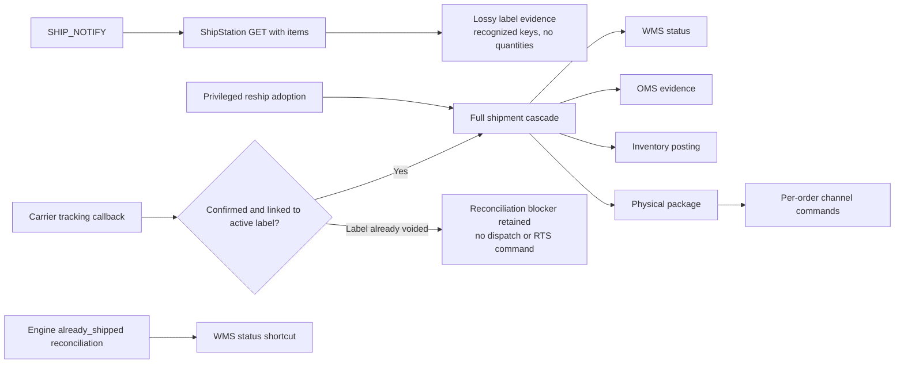
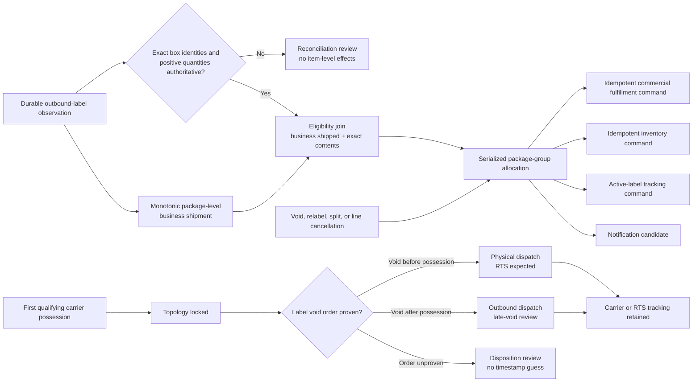

# Shipment Lifecycle and Label Authority Contract

Status: Phase 1 serialized planning and its inert effect outbox are implemented.
Phase 2 package-level business-shipment recognition is being wired separately
from item-level fulfillment, inventory, tracking, and notification execution.

## Purpose

The existing normal automated fulfillment flow delays business shipment,
inventory posting, and channel fulfillment until carrier possession. That
allowed operators to correct ShipStation labels before pickup, but it conflated
business shipment authority with physical carrier movement.

This contract separates those facts:

1. A durably observed provider-generated outbound label establishes a monotonic
   package-level business-shipped fact. A proven equivalent postage-purchase
   event may serve the same role, but the adapter must use neutral issuance
   terminology until the provider timestamp semantics are proven.
2. Authoritative box-level contents are a separate prerequisite for item-level
   fulfillment, inventory, tracking-assignment, and notification effects.
3. The package remains correctable until the first qualifying carrier-possession
   event occurs.
4. Carrier possession locks package topology. It does not create the initial
   business shipment.
5. Label void, fulfillment cancellation, commercial cancellation/refund, and
   physical return are independent operations.

The contract is provider-neutral. ShipStation is the first adapter.

## Executive Finding

The current workaround is structurally wrong, not merely misnamed. Echelon
records ShipStation label evidence, but the normal automated path waits for a
qualifying carrier event before it changes the WMS shipment, posts inventory,
materializes the physical package, and creates channel-fulfillment work. That
preserves a correction window only by treating carrier possession as the
shipment event.

The correct model separates three independent facts:

- **business shipped:** a durably observed generated outbound label;
- **contents authoritative:** exact Echelon line identities and positive box
  quantities are proven, allowing item-level effects to be planned; and
- **carrier locked:** the first qualifying carrier-possession event, after which
  package topology cannot be changed automatically.

Voiding or replacing a label inside that window changes label and tracking
evidence. It does not undo commercial fulfillment or return inventory. A second
active, contented package is a second physical dispatch and inventory
consumption, but it must not fulfill the same customer quantity twice.

## Current Runtime Flow (Proven in the Deployed Revision)

The production release inspected on 2026-08-20 was `v2695` at deploy commit
`5751d5aa`, the same commit used for this trace.

1. `server/index.ts:453-494` authenticates `SHIP_NOTIFY`, validates the resource
   URL, and delegates to `shippingEngine.processWebhook()`.
2. `server/modules/oms/shipstation.service.ts:3726-3779`
   `processShipNotify()` performs a ShipStation GET with shipment items and
   records the provider-label observation. It can also hydrate return direction
   and resolve an unmapped-return exception at `3742-3749`. It does not call the
   WMS shipment, inventory, physical-package, or channel-fulfillment writers.
3. `server/modules/shipping/carrier-tracking.domain.ts:226-263,583-636`
   validates the label observation but sanitizes every provider item down to a
   unique `lineItemKey`; quantity, SKU, and the distinction among omitted,
   empty, unrecognized, malformed, and mixed item arrays are lost.
4. `server/index.ts:89-91` installs the tracking route's raw-body handling before
   general JSON parsing. `shipstation-tracking-webhook.routes.ts:31-39` copies
   exact bytes before `JSON.parse` and `53-59` authenticates the callback.
   `carrier-tracking.service.ts:311-323` and
   `carrier-tracking.repository.ts:878-903` then persist those exact bytes before
   carrier-event normalization. `carrier-tracking.service.ts:1211-1224` enqueues
   dispatch only for confirmed evidence matched to a linked outbound label.
5. The dispatch worker calls
   `shipstation.service.ts:3781-3959` `confirmDispatch()`. It re-fetches the
   provider shipment, verifies identity and tracking, and currently rejects a
   voided label with `CARRIER_DISPATCH_PROVIDER_LABEL_VOIDED` before calling
   `processShipmentNotification()`.
6. The normal carrier-confirmed path reaches
   `shipstation.service.ts:3036-3232`. The same cascade is also reachable through
   privileged manual reship adoption at `shipstation.service.ts:3671-3684` and
   `shipstation-unmapped-remediation.service.ts:2156-2164`. Separately,
   `server/index.ts:1070-1076,1511-1517` can set an outbound WMS shipment to
   `shipped` when the shipping engine reports `already_shipped`, without running
   the complete inventory/package/channel cascade.
7. Inside the common full cascade, provider items are synchronized at
   `shipstation.service.ts:3098-3102`, inventory rows are loaded at `3120-3122`,
   the legacy WMS shipment changes at `3124-3128`, OMS audit evidence is appended
   at `3208-3213`, and inventory is posted at `3216-3221`. The ordinary
   single-group branch finalizes at `2990-2995`; combined/recovery branches
   finalize at `2252-2257,2867-2872,2975-2980`; and legacy fallbacks finalize at
   `3459-3465,3569-3575`. Canonical materialization is implemented at
   `2727-2764`.
8. `channel-fulfillment-authority.repository.ts:2021-2260` creates package and
   channel-command records transactionally. ShipStation passes
   `executeImmediately: false` at `shipstation.service.ts:2741-2764`, with the
   authority behavior at `channel-fulfillment-authority.service.ts:397-407`.
   The command worker's default poll interval is 15 seconds
   (`channel-fulfillment-command.worker.ts:6,63-82`), but startup is conditional
   at `server/index.ts:807-815`; 15 seconds is not a dispatch-latency guarantee.
9. `channel-fulfillment-authority.service.ts:203-217` bridges an eligible
   command into Shopify execution. `fulfillment-push.service.ts:2074-2110` can
   return already satisfied before any mutation. When execution requires a new
   `fulfillmentCreateV2` mutation, `2383-2405` sets `notifyCustomer: true`.
   Static code does not prove Shopify delivered a message, and
   `channel-fulfillment-authority.repository.ts:2190-2220` proves suppressed or
   ineligible package items can produce no command. No Echelon aggregation
   service exists in this path.

This trace proves why the current correction workaround works and why it is
incorrect: the normal automated dependent effects are downstream of carrier
possession, while label generation is retained only as lossy evidence. Manual
and reconciliation branches also prove that the generic WMS shipment status can
change without one consistent dependent-effect transaction.

### Current execution graph

## Authority Boundaries

### Commercial authority

OMS order lines define what the customer purchased, cancelled, or refunded.
ShipStation cannot create commercial demand.

### Declared physical-package authority

The shipping engine is authoritative for declared outbound packages, their
tracking identities, and their declared box contents. A provider package is
automatable only when every physical line contains:

- an exact Echelon-owned WMS shipment-item identity; and
- a positive integer quantity.

SKU-only matching is reviewer evidence, not automatic authority.

### Business-shipment authority

A durably observed provider-generated outbound label establishes the monotonic
package-level business-shipment fact even when its contents are missing or later
require review. Authoritative exact package contents separately make item-level
postings eligible. The adapter must retain the system observation time and the
provider occurrence time independently. It must not label a provider or
observation timestamp as postage purchase until that semantic is proven. Later
conflicting evidence removes current automation authority and requires
reconciliation; it does not erase the prior shipment fact or implicitly reverse
already executed effects.

A label with missing or contradictory contents therefore remains a shipped
package fact, but it cannot authorize item-level fulfillment, inventory,
order/channel tracking assignment, or customer notification.

### Carrier authority

The first qualifying physical carrier event locks package contents. The adapter
retains provider occurrence time and first durable observation separately.
Provider-authored times may order void versus possession only when both are
available and comparable; otherwise disposition is review, not a timestamp
guess. Webhook delivery order cannot change the result.

Carrier evidence is never discarded because the associated label is voided. If
the label was voided before carrier possession, the package is a physical
dispatch with return-to-sender expected. If the void occurred after carrier
possession, the outbound dispatch remains and the late void requires review.

## Independent State Axes

| Axis | Required states |
|---|---|
| Business shipment | `not_shipped`, `shipped` (monotonic) |
| Label | `unknown`, `active`, `voided`, later `superseded` |
| Provider content evidence | `not_observed`, `omitted`, `empty`, `unrecognized`, `malformed`, `mixed`, `authoritative` |
| Resolved contents | `unknown`, `authoritative`, `conflicting` |
| Correction | `unavailable`, `open`, `awaiting_relabel`, `carrier_locked`, `review` |
| Carrier | `not_confirmed`, `possession_confirmed`, later movement states |
| Disposition | `not_dispatched`, `outbound`, `return_to_sender_expected`, `review` |
| Commercial fulfillment posting | pending, succeeded, retry, review; customer quantity is capped by commercial authority |
| Inventory posting | pending, succeeded, retry, review; quantity follows physical dispatch allocation |
| Tracking projection | pending, active-label tracking, pre-possession void-removal, carrier/RTS tracking, succeeded, retry, review |
| Current automation / reconciliation | authoritative or blocked; clear or review |
| Notification | pending aggregation, held, sent, amended |

### Required execution graph

Commercial fulfillment and tracking are deliberately separate effects. A
pre-possession void may remove or supersede active-label tracking without
reversing fulfillment. Once carrier possession is proven, the physical
outbound/RTS tracking projection remains even when the label is voided.

`server/modules/shipping/declared-package-lifecycle.domain.ts` implements a
pure, single-package projection of the business, label, correction, carrier, and
disposition axes. It performs no database writes and reads no clock. It keeps
monotonic business recognition separate from current automation authority and
produces distinct commercial-fulfillment, inventory, active-label tracking,
pre-possession void-removal, carrier tracking, notification-candidate, and
notification-projection-reconciliation facts. This generic signal does not claim
a notification already exists. The notification aggregate uses its own durable
state to hold, rewrite an unsent candidate, or create a post-send amendment. The
single-package projector does not guess which. Its state hash excludes
evidence-only reprints; neither hash is a downstream-effect idempotency key.

The event schema requires `lead_approved`, actor, and reason fields for a content
attestation, but the pure projector does not authenticate that actor. The
application boundary must authenticate provider evidence and authorize the lead
before appending the event.

Those facts are not executable commands. Cross-package allocation must be
resolved first; otherwise a replay of void A, replacement B, and late carrier
possession for A could double-consume or under-consume inventory.

### Dependent-system effect matrix (required)

Each row describes command intent. Success, retry, and review remain separate
durable states; no projection flag proves that a downstream write succeeded.

| Observed operation | Business / commercial fulfillment | Inventory | Package and tracking | Customer-notification projection |
|---|---|---|---|---|
| Active label A with authoritative exact contents | Recognize shipped; make exact commercial quantity eligible once | Commit/post A's exact physical quantities once | Materialize A and project active tracking | Create or update a pending candidate |
| Same-label reprint | No change | No change | Same package and tracking; append evidence only | No change |
| Void A before possession | Never reverse already recognized fulfillment | Do not release stock; allocation becomes `awaiting_relabel` | Remove/supersede active-label tracking; retain A | Rewrite a pending candidate or create an amendment if already sent |
| Generate B with A's exact allocation | Transfer A's allocation; no second commercial fulfillment | No second consumption | Supersede A with B tracking | Replace A with B in the pending story or amend |
| Split A into B/C | Preserve the same commercial total | Atomically conserve A's exact quantities across B/C; uncovered quantity stays `awaiting_relabel` | Materialize B/C with their own tracking | Aggregate both boxes, subject to send/hold policy |
| Active A plus active B with exact contents | Cap customer fulfillment at ordered quantity | Record a second physical consumption for B | Materialize and track both; B starts `unclassified_additional_dispatch` unless purpose is proven | Add the extra package or hold for review; do not repeat generic fulfillment |
| First possession for an active label | No new fulfillment command solely because of the scan | No duplicate inventory command | Lock topology and retain carrier tracking | Release/advance only through the separate aggregation policy |
| Possession for voided A after allocation moved to B/C | Customer fulfillment remains capped | A and B/C each require physical consumption; raise an exception if authority is insufficient | Retain A as physical RTS/outbound evidence and keep B/C | Require an amendment with additional-dispatch/RTS context |
| Explicit fulfillment-line cancellation | Reduce only the exact cancellable commercial quantity | Change stock only through a separate unpack or return transaction | Never mutate a carrier-locked package | Rewrite pending demand or amend; never infer from label void |
| Missing, malformed, mixed, unrecognized, or conflicting contents | Recognize the package-level shipped fact; no item-level command | No item-level command | Retain evidence and review; never invent an empty package or assign tracking to an order | Hold or correct a pending projection |

All consumers must execute one immutable, versioned package-group plan through
idempotent outbox commands. WMS, OMS, inventory, channel tracking, and
notification code must not independently infer effects from generic shipment or
label status.

## Label and Package Corrections

### Same-label reprint

A reprint of the same provider label and tracking identity is an idempotent
artifact event. It changes the evidence hash and event count, but it does not
change the operational projection, shipment, fulfillment, inventory, active
tracking, or notification state.

### Void before carrier possession

Voiding a label does not cancel fulfillment. The package's committed exact
source-line allocation moves to `awaiting_relabel`; business shipment remains
shipped and inventory is not released to available stock. Active tracking for
the voided label is removed independently.

### Void A and generate replacement B

When A is voided before carrier possession, B may supersede A only when an
atomic group planner can prove:

- B uses the exact source-line allocation previously committed to A;
- B belongs to the same Echelon fulfillment lineage;
- B was generated after A became replaceable; and
- no competing candidate makes the transfer ambiguous.

Destination and service equality are not identity requirements. An address,
carrier, or service correction may be the reason A was voided. Those differences
must be captured in the immutable before/after audit and evaluated for policy
exceptions, but they do not turn B into an additional physical consumption.

B inherits A's existing fulfillment and inventory allocation. If multiple
voided packages are equally valid candidates, the planner stops for review
instead of choosing one.

### Void A and split into B/C

Exact source-line quantities transfer from A into B and C in one serialized
plan. Quantities not covered by a new active label remain
`awaiting_relabel`. The transfer must conserve the original commercial
fulfillment and inventory allocation and preserve every label, content revision,
and transfer as immutable evidence.

### Late carrier possession for voided A

Carrier evidence wins even after A was voided. A becomes a real physical
dispatch with `return_to_sender_expected`; the event is not discarded and the
package topology is locked.

If A's allocation had already transferred to B or B/C, the group planner must
reopen the allocation atomically:

- A again represents one physical inventory consumption;
- B/C remain real generated packages and therefore require their own physical
  inventory consumption;
- the shared transfer cannot count as both A's and B/C's consumption;
- customer fulfillment remains capped at the commercial order quantity;
- tracking and notification projections show the additional dispatch and RTS
  context; and
- inventory is restored only by an explicit return receipt and disposition.

If sufficient inventory authority cannot be proven for every physical
consumption, the unresolved quantity becomes an inventory exception. The
projector must not invent stock or suppress the carrier event.

### Active A and active B

Two active provider shipments with authoritative exact contents are two declared
physical packages, even when the contents are identical. Each consumes
inventory. Overlap with already fulfilled commercial quantity does not fulfill
the customer twice; it is an `unclassified_additional_dispatch` until an
audited purpose such as replacement is established. No inference about which
ShipStation UI action created B is required.

Approved adapter rule: if authenticated provider evidence exposes a reliable
explicit Reship action, Echelon treats that action as lead-approved replacement
intent; separate actor lookup is not required. Exact copied contents and
available physical-consumption authority must still validate. Without a reliable
Reship signal, B remains `unclassified_additional_dispatch`; a shipment with no
authoritative contents remains an exception.

A provider shipment with `empty`, omitted, unrecognized, malformed, or mixed
content evidence is not an empty-package conclusion and is not item-level
automation authority. Its observed label still establishes the package-level
shipment fact. The evidence is retained and raised for review. Unidentified
quantity and insufficient stock are also held for review; the system must not
invent contents or silently exceed commercial authority.

## Explicit Cancellation

The following are separate commands:

- void provider label;
- cancel fulfillment line and quantity;
- cancel/refund commercial order line and quantity;
- unpack and return committed inventory to a controlled location;
- receive a physical return and classify it as sellable, quarantine, or dispose.

No label event implies any of the other commands.

Before carrier lock, an explicit line-level fulfillment cancellation may reduce
only an exact quantity still in `awaiting_relabel`. Quantity already represented
by an active label must first enter an explicit void/content-revision allocation
plan; Echelon must not cancel it behind the provider's declared package. After
carrier lock, commercial cancellation can change remaining customer demand but
cannot erase the physical dispatch or its inventory consumption. Stock can
change only through the separate unpack/putaway or return-receipt process.

Until a reliable provider fulfillment-cancellation signal is proven, reopening
demand requires an explicit audited Echelon action. Every cancellation records
actor, reason, exact source line and quantity, before/after allocation, and an
idempotency key.

## Combined Orders and Packages

### Current implementation (proven)

The current WMS does not preemptively auto-combine. The only production-code
caller of `combineAll()` is the admin/lead HTTP route at
`server/modules/orders/picking.routes.ts:920-936`; the client invokes it from
an explicit **Combine All** button at
`client/src/pages/Orders.tsx:1013-1035,1984-1992`.

The automatic-candidate hash in
`server/modules/orders/combining.service.ts:119-145` includes parts of the
address and email, but omits recipient name, address line 2, country, and service
class, and truncates postal identity to five characters. Warehouse is outside
that hash: the composite grouping key at `659-670` includes warehouse, while
enablement at `161-193,675-680` allows the permissive path that can group missing
warehouse values together. The manual combine path checks ready/on-hold state and warehouse
at `combining.service.ts:413-460`, but does not compare recipient, full
destination, email, or service. It snapshots the parent address at
`combining.service.ts:581-599` without an override audit.

The backend uncombine route still exists at
`picking.routes.ts:938-950`, but no client call to it exists in the current
checkout. `uncombineOrder()` at `combining.service.ts:789-817` has no
pick/pack-start guard. The implicit paths are also unsafe: `combineAll()`
dissolves existing groups before rebuilding at `combining.service.ts:704-718`,
and manual merge dissolves groups at `523-539`; neither proves a pick/pack-start
guard. Group dissolve/create/member changes are also not wrapped in one explicit
transaction.

Service-level normalization is not ready for expedited launch:

- the shared enum and WMS field use `standard | expedited | overnight`
  (`shared/schema/orders.schema.ts:29,125`), with OMS usage proven at
  `shared/schema/oms.schema.ts:69` and `server/modules/oms/oms.service.ts:46`;
- the static shipping catalog uses
  `standard | expedited | express | pallet_freight`
  (`shared/schema/shipping.schema.ts:43-49`), while its stored code column is
  unconstrained at `942-978`; and
- Shopify ingestion currently hardcodes `standard` with a mapping TODO at
  `server/modules/oms/oms-webhooks.ts:607-609`.

The read-only production snapshot contained only `standard` on all 41,104 OMS
orders and all 61,403 WMS orders. Therefore the observed zero mixed-service
groups does not validate the grouping code. A separate integrity discrepancy is
also proven: 25 pending group rows record 51 orders, while only 23 groups and 45
member orders currently join back to WMS orders.

### Required policy

A pick group is an operational plan, not physical-package authority.

Automatic grouping requires:

- same warehouse;
- same recipient name;
- same normalized complete destination, including country;
- same normalized service class.

Email partitions notifications but does not block operational combination.
Unknown service classes cannot auto-combine. Different service classes cannot
share a pick group. Delivery promise is not a grouping input. SIOC remains a
planned package split.

The provider's exact package contents determine downstream effects:

- one package containing multiple orders produces one physical package and one
  fulfillment command per affected order/scope;
- multiple packages produce separate tracking identities; and
- an order receives only the tracking numbers for packages containing its
  exact lines.

Manual provider combination is accepted as operator authority and audited
nonblockingly when it violates automatic policy. Explicit uncombine, automatic
regroup dissolution, and manual merge dissolution are permitted only before
pick/pack execution starts.

## Customer Notification Follow-on

No consolidated shipment-notification service exists in the traced path. When
the current Shopify path requires a fresh `fulfillmentCreateV2` mutation, that
per-command request sets `notifyCustomer: true`; an already-satisfied execution
can return before mutation. Static code does not prove delivery of a message.
Therefore notification ownership must not change as part of the label-authority
cutover without a separate verified release.

Recommended follow-on design:

1. In the same transaction that makes a channel effect eligible, upsert a
   durable notification candidate. Do not send email from the label projector.
2. Send immediately only when a durable `package_plan_complete` or
   `pack_closed` fact proves that no additional package is expected, one active
   outbound package covers all currently shippable order quantity, and there are
   no unresolved package exceptions. Label count alone is not that proof.
3. Otherwise use a configurable settling window so labels B/C and other known
   packages can aggregate into one message containing every represented box,
   tracking number, carrier, and exact item quantity.
4. At a configured maximum hold, send an accurate partial-shipment message
   rather than waiting indefinitely. Later packages amend the shipment story;
   they do not repeat the original generic shipped notice.
5. A correction before send rewrites the pending projection from immutable
   package evidence. A correction after send creates an amendment with its own
   idempotency key and audit link.
6. Disable ShipStation/channel-native customer notifications only after the
   Echelon aggregator is proven per channel; otherwise customers can receive
   both the native per-package message and the consolidated message.

Still unresolved and intentionally not assumed:

- the settling-window and maximum-hold durations;
- whether multiple combined commercial orders may share one customer message or
  require one message per order/channel contract;
- channel-specific partial-fulfillment and tracking-amendment semantics; and
- the customer-facing copy for replacement, RTS, and post-send correction.

## What the Code Definitely Does

| Claim | Status | Evidence |
|---|---|---|
| Echelon emits stable WMS shipment-item keys | Proven | `shipstation.service.ts:4940-4958,5033-5040` emits positive `wms-item-{id}` rows; `830-866` validates those identities and positive quantities on readback. |
| SHIP_NOTIFY does not run the shipment cascade at label time | Proven | `shipstation.service.ts:3995-4047` performs a provider GET and label observation, plus limited return-label exception handling; it has no WMS shipment, inventory, physical-package, or channel writer. |
| Carrier-confirmed dispatch owns the normal automated full cascade | Proven, not exclusive | `shipstation.service.ts:4050-4250,2779-3239` re-fetches and durably observes current evidence before reaching the cascade. Manual reship adoption also reaches the guarded entry point at `3919-3961`; `server/index.ts:1070-1076,1511-1517` can mutate shipment status outside it. |
| A voided label's carrier event does not currently win | Proven defect | `carrier-tracking.domain.ts:673-705` resolves it as `voided_label`; `shipstation.service.ts:4135-4147` also rejects a label found voided during the carrier-authority re-fetch. |
| An ordinary empty provider item array could conditionally ship all existing WMS items | Proven baseline defect, closed in deployed Phase 0 | The low-level sync now throws before its first WMS item query at `shipstation.service.ts:1738-1752`; the shared fulfillment entry point independently requires exact provider item IDs and quantities for shipped automatic authority at `3845-3882`. Carrier rejection is classified nonretryably at `4221-4234`. Phase 0 was deployed in Heroku release `v2697` from merge commit `3123147fa51575d859c576bee460606df1dc389f`. |
| A second package after terminal fulfillment is not automatically trusted | Proven | `shipstation.service.ts:1413-1479` quarantines it; reship adoption is a separate privileged operation at `server/routes/oms.routes.ts:258-286`. |
| One provider package can span multiple WMS orders | Proven | `shipstation.service.ts:1970-2257` resolves exact ownership, selects an existing row whose status is neither `cancelled` nor `voided` or creates one at `2069-2130`, applies terminal checks at `2192-2232`, and finalizes one physical package at `2252-2257,2727-2764`. |
| A fresh Shopify fulfillment mutation requests customer notification | Proven request, not delivery | `channel-fulfillment-authority.service.ts:203-217` bridges eligible execution; `fulfillment-push.service.ts:2074-2110` can return already satisfied before mutation, while `2383-2405` sets `notifyCustomer: true` on a fresh `fulfillmentCreateV2` request. `channel-fulfillment-command.ts:184-249` groups per provider/OMS order/scope, and `channel-fulfillment-authority.repository.ts:2190-2220` can suppress command creation. The 15-second worker value is only a conditional default poll interval. |
| Normal inventory shipment posting omits the immediate change callback | Proven defect | `inventory.use-cases.ts:594-729` does not call `triggerNotifyChange()`; the listener at `server/services/index.ts:258-293` runs only from that callback. |
| ShipStation Split Ship creates distinct shipments with per-shipment contents | Proven by current provider documentation | <https://help.shipstation.com/hc/en-us/articles/360028798951-Split-Orders-Into-Multiple-Shipments> |
| ShipStation Reship creates another shipment and leaves the original intact | Proven by current provider documentation | <https://help.shipstation.com/hc/en-us/articles/4417332306587-Reship-an-Order> |
| ShipStation exposes a reliable Reship action marker through the current API | Not proven | Current provider documentation describes an app action, while current local contracts and retained evidence expose no such marker. Under the approved policy, a proven Reship action is treated as lead-approved; actor lookup is not required. |
| `shipDate` is label-generation or postage-purchase time | Not proven | Current parser intentionally leaves `labelCreatedAt` unknown; the sampled endpoint also exposes `createDate`, but its exact milestone semantics are not established. |

## Read-Only Production Evidence (2026-08-20)

The production audit used aggregate-only SQL inside
`REPEATABLE READ READ ONLY` transactions with statement, lock, and
idle-in-transaction timeouts and an unconditional `ROLLBACK`. The dedicated
`wms_integrity_auditor` role was verified read-only but lacked `SELECT` on the
new shipping tables, so the aggregates used the application database credential
inside those explicit read-only transactions. Missing auditor grants are an
operational gap; they were not changed.

Provider checks used only ShipStation GET requests with shipment items included.
The sanitized SQL/GET outputs emitted no identifiers, tracking numbers, customer
data, SKUs, costs, or credentials, and no external or database writes occurred.
Exact sanitized SQL/GET definitions, filters, release commit, and proof limits
for the manifest-backed snapshot are recorded in
`docs/SHIPMENT-LIFECYCLE-PRODUCTION-AUDIT-MANIFEST.md`.

Security incident: a separate Heroku release-metadata command unexpectedly
printed production config values into the internal tool transcript. This report
does not reproduce them. Treat every credential/config value printed by that
command as exposed and rotate it through the incident process. Do not use
`heroku releases:info` for metadata until its output behavior is safely bounded.

### Ledger coverage

- 5,561 ShipStation label rows: 5,503 active outbound, 39 voided outbound,
  18 active return, and 1 voided return.
- 10,350 label events: 10,283 active observations and 67 void events.
  Thirteen labels have both observation and void evidence; 4,259 labels have
  more than one retained event row, with a maximum of five. That aggregate does
  not prove distinct payloads or a same-label reprint action.
- `label_created_at` is populated on 0 of 5,561 labels. The retained label
  event window is 2026-07-21 through 2026-08-20.
- The latest sanitized payload has at least one recognized Echelon line key for
  5,513 labels and zero recognized keys for 48. None of the 5,561 latest
  snapshots retains quantity.
- 5,499 outbound provider-order groups exist. Thirty-nine have multiple labels;
  37 contain active and voided labels; two contain at least two active labels
  with the same retained recognized-key identity.
- The canonical physical ledger has 2,204 packages: 2,088 ShipStation shipped,
  1 ShipStation voided, and 115 Shopify shipped.
- Two hundred two shipping-engine orders have multiple physical packages:
  169 have distinct exact contents and 33 have repeated exact contents.
- Physical item purposes are already present: 4,456 customer-fulfillment lines
  / 10,762 units, 35 replacement lines / 86 units, 3 omission-correction lines
  / 3 units, and 2 concession lines / 6 units.

### Observed correction and package flows

- The lossy label ledger shows 36 of the 37 active-plus-voided groups with the
  same recognized key identity and one indeterminate group. Read-only GET
  verification of two active-plus-voided groups found one with identical exact
  line/quantity contents and one with different exact line/quantity contents.
  Provider action type and event chronology were not proven.
- Each of the two active-active groups has two active labels but exactly one
  carrier-confirmed label and one physical-package link. A GET-only verification
  proved exact line/quantity equality for one group. This is direct evidence of
  the additional-active-package case and of the current delayed-posting gap.
- Exactly three canonical physical packages span more than one WMS order. All
  three are ShipStation shipped packages with two item lines and two WMS orders;
  their aggregate unit totals are 3, 4, and 26. One was GET-verified as two
  valid mapped provider lines / four units across two WMS orders.
- The latest ledger's 48 zero-recognized-key labels do not prove empty
  ShipStation shipments. Both of two GET-only samples had nonempty provider item
  arrays whose keys were not valid Echelon identities. A truly empty shipment
  remains unproven.
- Nineteen retained `not_confirmed` carrier-event snapshots across nine voided
  labels were received or effectively timestamped after void; 18 also have
  provider occurrence times after void. Zero labels have confirmed carrier
  possession after void under receipt time, provider occurrence time, or the
  normalized-tracking cross-check. Late possession after void is therefore a
  required guarded design case, not an observed production incident.
- A separate production `--dry-run` transiently observed four parseable provider
  packages and classified the component unsafe because one WMS unit lacked
  current provider-membership proof. The code path used provider GETs and gated
  all apply/finalization calls behind mutation authority that dry-run does not
  receive (`repair-historical-shipstation-splits.ts:276`;
  `historical-shipstation-split-repair.service.ts:423,532,613`). No standalone
  execution artifact or before/after database snapshot was captured, so this is
  a qualified observation and required test fixture, not durable production proof.
- Open ShipStation-related exceptions include two
  `historical_replacement_inventory_unproven`, four `ship_notify_no_match`,
  and three `shipstation_unmapped_physical_shipment` cases.

### Reconstruction limits

Echelon retains exact raw authenticated carrier-tracking callbacks, but it does
not retain raw SHIP_NOTIFY bodies or raw ShipStation GET responses. The durable
label snapshot keeps recognized line keys only and discards quantity, SKU,
ShipStation `orderNumber`, and invalid/unrecognized provider rows, while
retaining provider order ID/key. Therefore
historical exact package contents generally cannot be reconstructed from the
label ledger alone.

Still unproven:

- the exact provider milestone represented by `createDate` and a durable
  provider-authored label-issuance time;
- whether ShipStation exposes a reliable Reship action marker through the
  observed API. Actor identity is not required by the approved policy: a proven
  ShipStation Reship action is treated as lead-approved;
- a truly empty provider shipment in current production;
- confirmed carrier possession after label void;
- exact line/quantity distributions for all 37 relabel groups; and
- whether another scheduled process compensates for the missing immediate
  inventory-change callback.

## Schema Direction for Runtime Phase

Status: the inert Phase 1 ledger and persistence foundation is installed by
`198_package_allocation_ledger_foundation.sql` and
`199_package_allocation_persistence_foundation.sql`. Its planner and repository
remain unwired from production runtime paths, and every stored effect intent is
database-constrained to `executable = FALSE`. This foundation does not authorize
runtime projection, provider mutation, inventory posting, commercial
fulfillment, or customer notification. Provider-facing field names and
timestamp semantics remain provisional until each enabled operation is proven
through durable natural-traffic or controlled evidence.

The current model already has useful immutable label-event evidence, physical
package rows, exact physical lines, replacement-purpose lineage, and durable
channel commands. It does not encode package correction topology, and the
durable provider-label payload currently discards item quantities.

Confirmed schema blockers:

- `shared/schema/fulfillment.schema.ts:318-394` stores label identity, status,
  timestamps, and event payloads, but no content revision, content authority,
  correction state, or independent posting state.
- `server/modules/shipping/carrier-tracking.domain.ts:245-263` sanitizes
  shipment items down to `lineItemKey` only; quantity is lost before durable
  label evidence is written.
- `shared/schema/fulfillment.schema.ts:262-315` gives a physical shipment one
  mutable status and makes `legacy_wms_shipment_item_id` globally unique. That
  cannot represent a partial source-line allocation across replacement labels
  without either rewriting history or introducing a separate allocation ledger.
- `shared/schema/orders.schema.ts:382-414` has no normalized service-class
  snapshot on a combined group.

Recommended minimal additions after evidence hardening:

1. Preserve immutable provider observations with an explicit content-evidence
   shape: `omitted`, `empty`, `unrecognized`, `malformed`, `mixed`, or
   `authoritative`. Authoritative revisions retain exact WMS shipment-item
   identity and positive quantity. Every revision also retains evidence source,
   provider occurrence time when present, system observation time, provider
   event key, redacted payload hash, and payload schema version. Classification
   precedence is deterministic: conflicting exact fingerprints, then any active
   non-authoritative evidence, then one exact fingerprint, then unknown. Later
   evidence never silently resolves an earlier exception. Only an authorized
   lead attestation with an audit reason may resolve named, non-authoritative
   prior evidence; it may never overwrite provider-authoritative exact evidence.
   Timestamps are canonicalized to UTC at the explicitly supported precision.
   The proof projector accepts through milliseconds and rejects finer precision
   instead of truncating chronology; Phase 0 must prove whether any provider
   operation requires a finer representation before runtime wiring.
2. Project independent package fields for monotonic
   `business_shipment_recognized_at`, current automation authority,
   reconciliation status, correction status, carrier disposition, provider
   occurrence times, observation times, and lifecycle version. Do not overload
   the existing generic shipment status with these facts.
3. Add an immutable, versioned allocation ledger that conserves exact
   source-line quantities across void A to B and split A to B/C. It must
   distinguish allocation transfer from additional physical consumption and
   atomically rebalance when voided A later receives carrier possession.
4. Give commercial fulfillment, inventory, active-label tracking,
   pre-possession void-removal, carrier/RTS tracking, notification candidate,
   pending-candidate rewrite, and post-send amendment separate durable
   idempotency keys and attempt/retry state. The notification aggregate resolves
   the projector's generic reconciliation signal from its own durable send state.
   A label event must never imply that every dependent effect succeeded.
5. Store automatic-combination policy snapshots and nonblocking manual-override
   audit evidence, including warehouse, normalized recipient/address/service
   class, actor when proven available, reason, and before/after membership.

Every multi-row projection must run in one transaction with package-scoped
serialization and database uniqueness enforcing event replay and posting
idempotency. Immutable evidence is appended; corrections create new revisions.

Do not solve this by adding a `printed_but_not_shipped` state or by changing the
meaning of carrier state. Business shipment and carrier movement must remain
separate facts.

## Recommended Delivery Sequence

### Phase 0: evidence hardening and current safety defects

This phase changes no shipment lifecycle authority.

1. Quarantine every provider shipment that lacks authoritative exact
   `{wmsShipmentItemId, quantity}` contents before any ordinary WMS
   shipment-item load or inventory posting. This closes the proven blank-array
   fall-through independently of the larger redesign.
2. Retain append-only, redacted provider observations with explicit evidence
   shape and exact line quantities. Preserve invalid/unrecognized row counts and
   a payload hash; do not relabel zero recognized keys as empty.
3. Capture provider `createDate`, `voidDate`, `shipDate`, observation time,
   and source independently. Do not assign purchase semantics until proven.
4. Phase 0A runs the new projector against natural traffic through a dedicated
   read-only credential and emits only bounded aggregate logs or metrics. It has
   no WMS, inventory, channel, notification, provider, or shadow-result database
   writes. If durable per-package mismatch history is later required, authorize
   it separately as Phase 0B through an append-only redacted ledger; that worker
   is no longer strictly read-only even though it remains isolated from shipment
   effects.
5. Correct the ten-minute reconciler's misleading `markedShipped` /
   `markedVoided` counters: its current ShipStation adapter refreshes label
   observations only.
6. Verify and repair the missing normal-shipment inventory change notification
   path, with an integration test proving the intended channel-availability
   consequence.
7. Grant the dedicated read-only auditor role least-privilege `SELECT` on the
   shipping evidence tables and rerun the sanitized manifest queries through that
   role. Do not normalize application credentials as the audit path.

Deployment status as of 2026-08-21: Phase 0 is deployed in Heroku release
`v2697` from merge commit `3123147fa51575d859c576bee460606df1dc389f`, while
`SHIPMENT_LIFECYCLE_SHADOW_ENABLED` is unset and the job requires exact `true`.
The projector is therefore present but disabled. No production flag, grant,
certificate setting, database row, or provider record was changed during the
post-deploy proof.

Activation/cutover blocker -- provider-link quantity authority (proven current
chain):

- `carrier-tracking.repository.ts` method `reconcileProviderLabelLinks` builds
  `provider_item_targets` from retained `shipmentItems[].lineItemKey` values and
  creates label links for the owning outbound shipment item, but it does not use
  or validate each retained quantity when authorizing those links.
- The same repository's transaction `findMatchCandidates` returns
  `COUNT(DISTINCT link.id)` as `linkCount` without filtering the links by exact
  content evidence or allocated quantity.
- `carrier-tracking.service.ts` private method `persistAndMatch` enqueues a
  dispatch command for confirmed carrier evidence, one matched outbound label,
  and `selectedCandidate.linkCount > 0`.

Therefore a key-only historical link can satisfy the current carrier-dispatch
lineage gate even when package quantity is absent, invalid, or not allocated
across packages. Cross-package allocation and conservation are unresolved, so
this contract does not invent a per-link equality rule. Exact, conserved package
allocation must replace key-only lineage before lifecycle-authority cutover.
Phase 0 shadow execution remains non-authoritative: this blocker neither permits
shadow results to drive effects nor authorizes disabling the current production
dispatch path.

Additional activation blockers proven in this branch:

- Manual reship adoption now compares the reviewed authority with the complete
  persisted candidate contents at `shipstation.service.ts:3773-3843,3117-3135`.
  That comparison and the later inventory load at `3137-3139` do not share a
  transaction, row lock, advisory lock, or immutable contents version. A
  concurrent remediation retry can therefore change the candidate after the
  comparison. Keep this path non-authoritative until prepare, comparison, and
  transition are serialized or protected by a contents-version compare-and-set,
  with a controlled interleaving test.
- A post-deploy connection using only the dedicated audit URL and strict TLS
  verification failed with `DEPTH_ZERO_SELF_SIGNED_CERT` before `BEGIN` or any
  SQL ran; Heroku Enhanced Certificates were off at that check. The activation
  hardening build accepts only the reviewed verify-full/root-certificate URL
  parameters, pins the parsed endpoint and credential fields so `PG*`
  environment values cannot replace them, and keeps hostname verification on.
  Activation remains blocked until that build is deployed and the dedicated
  connection, session role, grants, transaction mode, and TLS session are proven.
- The activation hardening query is one bounded page with conservative label,
  per-label-event, total-event, per-event-byte, and page-byte limits. Its internal
  continuation uses immutable label IDs and is not emitted by the command; the
  supporting provider/ID index bounds the intended access path. Each invocation
  is still a separate database snapshot, so this is not proof of one complete
  cross-page scan. Production query plan, runtime, and memory remain unproven and
  require one supervised page before any scheduling or flag activation.
- `wms.outbound_shipments.shipstation_order_id` is a PostgreSQL `integer`
  (`shared/schema/orders.schema.ts:475`), while three remaining external-value
  paths accept wider JavaScript-safe integers: create-order response persistence
  (`shipstation.service.ts:5490-5513`), historical repair parsing/writes
  (`historical-shipstation-split-repair.service.ts:214-247`;
  `historical-shipstation-split-repair.repository.ts:881-908,947-953`), and
  enrichment (`scripts/enrich-shipstation-physical-shipment-ids.ts:474-480,945-959`).
  The actual production ID range is unproven. Widen the column or guard every
  write boundary before these paths are activated under the new lifecycle.

### Phase 1: serialized cross-package planning

1. Introduce the immutable source-line allocation ledger and a deterministic
   group projector covering same-label reprint, void/relabel, B/C split, active
   duplicate package, exact line cancellation before/after carrier lock, and late
   possession for A.
2. Lock the package/allocation group in one transaction; compare an expected
   lifecycle version; enforce nonnegative quantities and exact conservation with
   database constraints.
3. Produce an outbox plan of idempotent dependent commands. Do not execute a
   single-package eligibility flag without this group decision.
4. Add unit, property, replay, concurrency, and partial-failure tests, including
   a fixture for the transcript-only observation in which one unit lacked
   provider-membership proof.

### Phase 2: label-time business shipment

Implementation status: migration `0637_declared_package_business_shipments.sql`
records one append-only package-level business-shipped fact in the same database
transaction as a new label event only when retained provider evidence explicitly
contains `isReturnLabel: false`. Unknown and return direction do not qualify, and
historical rows are not inferred from old direction defaults. Migration
`0641_package_allocation_commercial_fulfillment_shadow.sql` and the OMS
fulfillment-authority repository can now bind a newly emitted commercial intent
to the exact `primary_transfer` entries from the same still-current plan,
materialize split-safe physical items, and persist canonical channel commands in
the non-dispatching `shadow` state. Exact replay is read-only, stale
unmaterialized plans fail closed, and the existing worker still claims only
`pending` and `retry`. No runtime caller or `shadow`-to-`pending` activation gate
is enabled yet; inventory and tracking effects remain separate later slices.

1. On any newly observed outbound label, record the monotonic package-level
   business-shipment fact immediately; do not wait for exact contents or a
   carrier scan.
2. Only when authoritative exact contents are available, project exact package
   lines and submit the package-group plan. Otherwise retain the shipped package
   fact, block item-level effects, and create a review exception.
3. Post inventory and commercial fulfillment through separate idempotent
   commands. Commercial quantity is capped once; inventory follows every proven
   physical consumption.
4. Project active-label, pre-possession void-removal, and carrier/RTS tracking
   separately. A pre-possession void removes or supersedes active-label tracking
   without reversing commercial fulfillment or inventory. Carrier possession
   preserves a physical tracking projection even if the label is later voided.
5. Let the first qualifying carrier event lock topology. A voided-label event is
   retained and invokes the group reallocation/RTS rule instead of being
   rejected based on event arrival order.
6. Use retryable outbox workers and explicit review states for every partial
   failure. Do not place remote channel calls inside the database transaction.

### Phase 3: combination and service-class correctness

1. Define one canonical service-class catalog and mappings before expedited
   shipping launches. Unknown values do not auto-combine; different normalized
   classes never share a pick group.
2. Run deterministic grouping automatically when orders enter or change the
   eligible queue, keyed by warehouse, recipient name, normalized full
   destination/country, and normalized service class.
3. Preserve SIOC as a planned package split. Delivery promise remains outside
   this grouping key.
4. Make create/dissolve/member changes transactional and enforce the pre-pick /
   pre-pack guard on explicit uncombine, automatic regroup dissolution, and
   manual merge dissolution.
5. Accept a provider/manual override with nonblocking audit; operator authority
   is not rejected because it violates the auto-combine policy.

This phase may run in parallel with lifecycle work, but its service-class guard
must be live before expedited shipping.

### Phase 4: one customer shipment story

1. Build the durable notification candidate/outbox and aggregation policy after
   package projection is authoritative.
2. Require `package_plan_complete` or `pack_closed` for an immediate
   single-package message; otherwise debounce and enforce a maximum hold.
3. Send one order/channel message containing every known box and exact contents,
   then use explicit amendments for later corrections or packages.
4. Disable native per-package notification only after the Echelon path is proven
   for that channel, preventing duplicate customer messages.

## Evidence Acquisition Matrix

No ShipStation test store is currently available, and there is no reason to
mutate production merely to manufacture evidence. Phase 0 must capture and
sanitize these operations when they occur naturally. If a non-production store
is added later, the same matrix can be executed there deliberately.

| Scenario | Current proof status |
|---|---|
| One-line and multi-line outbound labels with quantities | Endpoint shape supports quantity; current durable ledger discards it |
| Same-label reprint | Provider documentation proves same label/tracking; durable event semantics still need capture |
| Void A, identical replacement B | One active-plus-voided same-provider-order pair was GET-verified with identical exact contents; replacement intent and chronology remain unproven |
| Void A, changed/split B/C | One active-plus-voided group was GET-verified with different exact contents; whether caused by edit or split, and the A to B/C sequence, remain unproven |
| Partial quantities moved among split shipments | Not yet durably captured end to end |
| Additional active shipment with identical contents | One production group was GET-verified exactly; a second is proven by lossy key identity only |
| Provider shipment with a truly empty item array | Not proven; two zero-recognized samples were actually nonempty |
| Multiple Echelon orders in one provider package | Proven in code and three production physical packages; one GET-verified |
| Combined package split into order-subset boxes | Not yet proven end to end |
| Return label | Return label rows exist; correction and notification behavior is not proven |
| Carrier possession for an active label | Proven current code path and production physical packages |
| Carrier possession for a previously voided label | Guarded design case; zero confirmed production examples |

For each fixture, prove:

- webhook resource type and ordering;
- stable provider package/label identity;
- exact line keys and quantities;
- label status and void evidence;
- destination, warehouse, carrier, and raw service code;
- any reliable provider Reship action marker;
- which timestamp is provider-authored and which is system-observed;
- replay behavior and API reconciliation behavior.

No production mutation is authorized by this matrix.

## Automated Proof Baseline

Verification after the final contract corrections:

- 9 provider/ShipStation test files / 164 tests passed;
- 7 lifecycle projector, evidence, audit, and credential test files / 188 tests
  passed;
- 4 dependent OMS/inventory test files / 99 tests passed, covering SHIP_NOTIFY
  V2, unmapped/reship remediation, channel-command planning, and replacement /
  on-hand shipment inventory;
- 4 direct carrier, inventory, and channel test files / 44 tests passed; and
- `npm run check` (TypeScript) passed.

The new projector is not wired into runtime code. These passing suites prove the
artifact is internally consistent and does not disturb the selected existing
paths; they do not prove the proposed lifecycle in production. They also do not
prove caller authentication or authorization for content attestation; that
remains an explicit application-boundary requirement.

Several current passing tests intentionally encode behavior this contract will
replace:

- ignore package edits until carrier-confirmed shipment;
- promote labels only after carrier possession;
- reject carrier possession against voided labels; and
- quarantine every distinct package after terminal fulfillment.

Those tests must be changed only when the replacement projector, idempotent
dependent commands, and shadow reconciliation are present together.

The 41-test pure lifecycle suite proves:

- monotonic package-level business shipment at durable label observation,
  independent of whether exact contents are currently authoritative;
- item-level automation authority only with exact contents and no unresolved
  review reason, while retaining provider occurrence time separately;
- distinct omitted, empty, unrecognized, malformed, and mixed evidence;
- deterministic evidence precedence, UTC canonicalization for equivalent
  timestamp instants, explicit rejection beyond millisecond precision, and
  validated lead-approval metadata for named-event resolution that cannot
  replace authoritative provider evidence;
- no new automatic effects for missing, unresolved, conflicting, or impossible
  provider chronology;
- monotonic business recognition when later evidence blocks current authority;
- separate commercial fulfillment, inventory, active-label tracking,
  pre-possession void-removal, carrier tracking, notification-candidate, and
  notification-projection-reconciliation eligibility;
- void-to-`awaiting_relabel` without fulfillment reversal;
- carrier lock, outbound/RTS disposition, and tracking preservation independent
  of business shipment;
- post-scan lead contents attestation without topology unlock;
- equivalent-observation-time handling, out-of-order projection, and exact replay
  idempotency;
- same-label reprint changes the evidence hash but not the state hash; and
- classified conflicting event, tracking, content, and resolution evidence.

## Exit Gate for Runtime Wiring

Runtime behavior must not move from carrier-confirmed dispatch to observed
provider label issuance until all of these are true:

1. Durable natural-traffic or controlled evidence proves the provider fields,
   identities, quantities, and timestamp semantics for the operation enabled.
2. Package evidence distinguishes omitted, empty, unrecognized, malformed,
   mixed, and authoritative contents; automatic authority requires durable exact
   WMS identities and positive integer quantities.
3. The ordinary empty/unrecognized-item fall-through is closed before any
   shipment or inventory mutation.
4. Cross-package supersession, split, additional-dispatch, and late-possession
   planning conserves exact quantities atomically and is tested under replay and
   concurrency.
5. Commercial fulfillment, inventory, active-label / pre-possession-void /
   carrier tracking, notification candidate, pending rewrite, and post-send
   amendment commands have separate durable idempotency keys, outbox state, and
   retry / review outcomes.
6. A label void cannot cancel customer fulfillment or release inventory
   implicitly.
7. Carrier possession against a voided label is retained, locks topology, and
   invokes the RTS/reallocation rule regardless of webhook arrival order.
8. Shadow projection reconciles against current production evidence with every
   mismatch classified and no unproved historical reconstruction.
9. Unknown, contradictory, or impossible chronology removes current automation
   authority and produces review with no guessed new mutation or implicit
   reversal of an already recognized shipment.
10. Per-channel customer-notification ownership is proven so label-time channel
    projection cannot create duplicate or premature package messages.
11. Canonical service-class grouping and pick/pack-safe guards for every explicit
    or implicit group dissolution path are live before expedited shipping is
    enabled.
